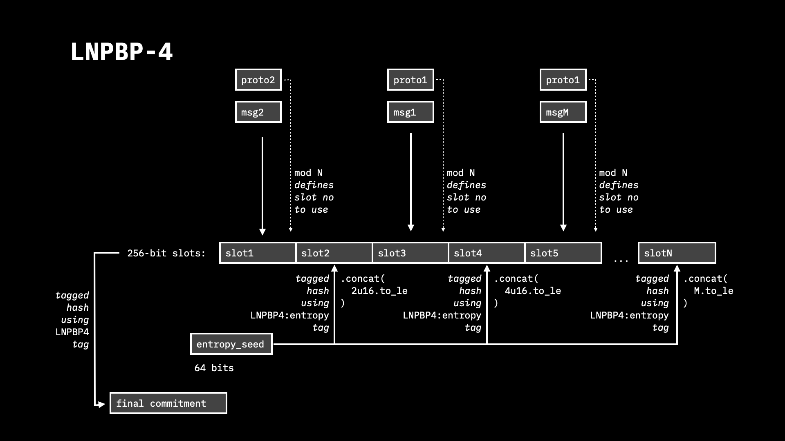

# 3.4. Multi-protocol commitments

There could be two different protocols willing to put different commitments into a single transaction output; and only one of the protocols may succeed since a transaction can contain only a singular commitment. It is also possible that some protocol may require committing to a number of messages within a single transaction and public key with the requirement that some dedicated information from these messages (like the message type) should be unique across the whole message set. For instance, this is required for state updates, where such updates separated into different blocks (messages) and should be kept private, such that a single party will know information about a single update and should not be disclosed any information about the rest. However, in such case, there should be a proof that the other state updates do not affect the state of the analyzed update, excluding state collisions. In such a setup, each state may be assigned a unique integer identifier (like cryptographic digest), and a special form of zero-knowledge proof should be utilized to proof the fact that all the states are different without exposing the actual state ids.

While both cases are impossible at the level of deterministic bitcoin commitment standards, a dedicated procedure for structuring multiple independent messages was proposed, named “**multi-protocol commitments**”. With it, some properties of the committed messages may be proven in a zero-knowledge way, i.e. without revealing any information about the source messages or the properties themselves.

Multiple commitments under different protocols are identified with a unique per-protocol 256-bit identifiers (like tagged hashes of protocol name and/or characteristic parameters) and serialized into 256-bit slots within `N * 32` byte buffer such as `N >> M`, where `M` is the number of the individual commitments. The rest of the slots is filled with random data deterministically generated from a single entropy source. The position `n` for a commitment with the identifier `id`  is computed as `n = id mod N`, guaranteeing that no two commitments under the same protocol with a given `id` may be simultaneously present.

<figure><figcaption></figcaption></figure>
