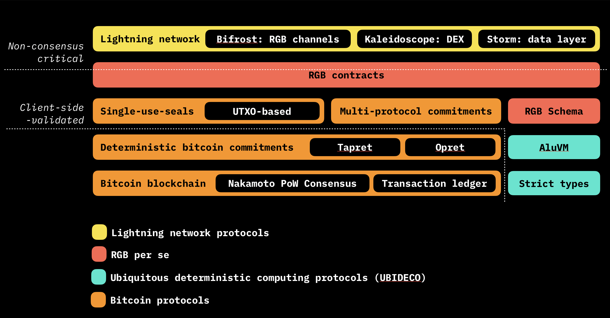

# 2.2. Design overview

The RGB smart contract system operates at multiple levels, abstracted from each other.

<figure><figcaption></figcaption></figure>

RGB smart contracts operate with **client-side validation** paradigm, meaning that all the data is kept outside of the bitcoin transactions, i.e. bitcoin blockchain or lightning channel state. This allows the system to operate on top of Lightning Network and also gives a foundation for a high level of protocol scalability and privacy.

The base level of RGB is bitcoin blockchain, including both Nakamoto PoW consensus and transaction ledger: while we do not require to store any data outside of cryptographic commitment on-chain, we still have to follow existing infrastructure and re-utilize bitcoin transactions as a storage for that commitments. This is done with other bitcoin protocol layers on top, creating foundation of client-side-validation: deterministic bitcoin commitments, single-use-seals and multi-protocol commitments. While used by RGB, these protocols are not RGB-specific and designed to allow RGB to work together without collisions with other (future) protocols utilizing client-side-validation paradigm.

As a security mechanism RGB uses **single-use seals** defined over bitcoin transaction outputs, which provides ability for any party having smart contract state history to verify its uniqueness. In other words, RGB leverages Bitcoin script for its security model and definition of the **ownership** and **access rights**.

Additionally to the aforementioned set of bitcoin protocols providing foundations for the client-side-validation, RGB smart contracts are also based on ubiquitous deterministic computing, including **strict types** and **AluVM**, utilized by **RGB schema**: a set of rules defining how smart contracts can evolve over time and how they are validated on the client-side. Taken together these layers enable the core consensus-level functionality of RGB contracts, on top of which a set of contract interfaces is defined to allow applications to interact with the contracts. Lightning channels, operating (some) of RGB contract state, as well as more complex applications, including DEX and decentralized data network are built using those interfaces.

Each RGB smart contract is represented by some **genesis state**, created by **smart contract issuer** (or, put simply, issuer) and a directed acyclic graph (DAG) of **state transitions** kept in form of _client-validated data_ (i.e. this data is not stored on blockchain or within LN transactions/channel state). The state is **assigned** to unspent bitcoin transaction outputs, which defines them as _single-use seals_. The party that is able to spend corresponding transaction output is named a party **owning state**: it is a party that has the right to change the corresponding part of the smart contract state by creating a new _state transition_ and committing to it in a transaction spending the output containing previous state. This procedure represents **closing of a seal**, and a pair of spending transaction and corresponding **extra-transaction data** on the state transition are named **witness**.

_State transition_ **assigns** _state_ to a set of defined **single-use seals**. Each smart contract may maintain different forms of state and define different kinds of single-use seals with different validation rules. Additionally to this, state transition may define different _global state_ and contain  _metadata_, used by schema _scripts_ during state transition validation on AluVM.

Which types of global and owned state, seals, metadata are allowed within state transitions is defined by **schema**. Thus, schema can be seen as validation rules for _client-side validation_; schema is always defined by the issuer in state genesis. Schema also may contain Turing-complete _scripts_ defining parts of the business logic for _client-side validation_.

RGB operates in “shards”, where each contract has a separate **state history** and data; different smart contracts never intersect in their histories directly. This allows another level of scalability; and while the term “shard” is incorrect, we use it to demonstrate that RGB actually achieves what was planned to be achieved with “Ethereum shards”.

While being separately maintained, RGB contracts may interact via **Bifrost** protocol over the Lightning Network, allowing multiparty **coordinated state changes**, which, for instance, enables functionality like DEX over Lightning etc.

Thus, by their abilities RGB smart contracts go beyond what is possible with Ethereum-like smart contract system, providing more layered, scalable, private and safe approach, where the ownership of the smart contract state is separated from the smart contract creation.

As a smart contract system RGB is quite different from previous approaches, both Bitcoin-based (Colored coins, Counterparty, OMNI) and non-bitcoin (Ethereum, EOS and others):

* RGB separates concept of smart contract **issuer**, **state owners** and **state evolution**
* RGB keeps the smart contract code and data off-chain
* RGB uses blockchain as a state commitment layer and Bitcoin script as an ownership control system; while smart contract evolution is defined by off-chain **schema**
